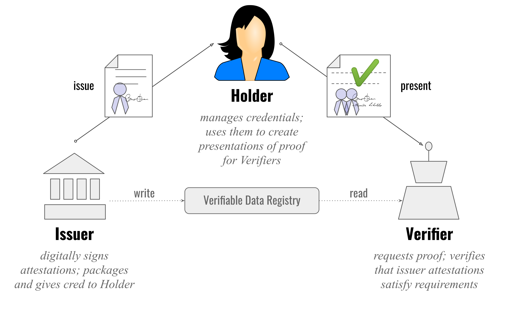

# NodeJS samples for Indy SDK illustrating self-sovereign identity (SSI)

This demo illustrates how identity blockchain agents can be used to issue verifiable credential from an issuer to a prover and later verified by a verifier using a proof.

Wiki for verifiable credential: https://en.wikipedia.org/wiki/Verifiable_credentials




## Requirements
* Python 2.7.16 (Exacty this version)
* libindy built and setuped [(Instructions)](https://github.com/TrustNetPK/indy-env-setup) 
* A locally running indy network on 127.0.0.1 [(Instructions)](https://github.com/TrustNetPK/indy-env-setup) 
* Node 8.x or greater


## Usage

```
git clone https://github.com/TrustNetPK/trustnet-nodejs-sample.git
cd trustnet-nodejs-sample
npm install
```


*Run the agents in following order

### To run verifier
```
cd trustnet-nodejs-sample/src
node verifier.js
```

### To run prover
```
cd trustnet-nodejs-sample/src
node prover.js
```

### To run issuer
```
cd trustnet-nodejs-sample/src
node issuer.js
```


## Demo Video
</hr>

[](https://www.youtube.com/watch?v=f9Apo_SO0Os)
